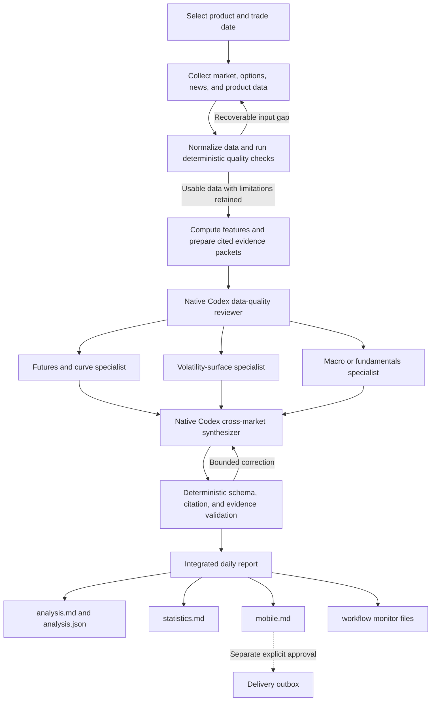

# CurveLens Core

CurveLens Core is a shared futures-and-options analysis framework. One checkout
can operate multiple commodity products while keeping each product's data,
workflow state, schedules, and delivery state isolated.

The included product profiles are:

| Product | Specialist perspectives |
|---|---|
| WTI | Futures curve, volatility surface, physical fundamentals |
| Gold | Futures curve, volatility surface, macro |
| Corn | Futures curve, volatility surface, crop fundamentals |

The deterministic engine and native-agent workflow are shared. Product facts,
required analyses, knowledge, calendars, and data providers come from the
selected product profile. Repository code does not call a model API, model SDK,
or vendor-model CLI; analytical work is delegated through the operating
Codex/OpenClaw environment.

## Workflow

`agent/analysis_orchestrator.py` is the durable controller. It emits the next
allowed native-agent action, validates each returned response, records monitor
events, and resumes from `run.json` after an interruption.



At a high level:

1. Deterministic code collects, normalizes, checks, and calculates. Missing or
   recoverable inputs can be retried; unresolved limitations are retained rather
   than hidden or replaced with fabricated data.
2. A native Codex quality reviewer decides whether the prepared evidence is
   usable, usable with limitations, retryable through an allowlisted remedy, or
   blocked.
3. Product-configured specialists independently analyze the futures curve,
   volatility surface, and macro or fundamental evidence. Each specialist must
   cite its packet and provide exact values, comparisons, plain-English meaning,
   news alignment or conflict, and a bounded forward view.
4. A synthesizer ranks the three most important market views. Each view connects
   validated numbers with supporting and conflicting evidence, assesses whether
   the apparent driver is supported or unexplained, and states what to watch
   next.
5. Deterministic validation checks every role, citation, required field, and
   copied metric before rendering the report. Analysis completion never
   authorizes delivery by itself.

The controller persists every phase, so an interrupted run can resume without
repeating completed work. Temporary specialists exist only for the run; their
tasks, evidence boundaries, responses, and validation results remain available
for inspection.

## Outputs

Runtime output is isolated by product and trade date:

```text
ccvm/data/products/<product>/
├── analysis/trade_date=<date>/
│   ├── analysis.md
│   ├── analysis.json
│   ├── mobile.md
│   └── statistics.md
└── analysis_workflow/trade_date=<date>/
    ├── run.json
    ├── workflow_monitor.md
    ├── workflow_monitor.json
    └── workflow_events.jsonl
```

| Output | Purpose |
|---|---|
| `analysis.md` | Primary human-readable report. It combines the top three views, exact supporting statistics, news or driver assessment, conflicts, specialist detail, and forward watch items. |
| `analysis.json` | Validated structured form of the same analysis for downstream tools and delivery formatting. |
| `mobile.md` | Phone-first brief containing the bottom line, three ranked views, two key numbers per view, driver, conflict, watch item, and one material data note. Notification preparation uses this exact format. |
| `statistics.md` | Numerical audit supplement containing the market snapshot, desk-level measures, comparisons, evidence coverage, and retained limitations. It is not a separate forecast. |
| `workflow_monitor.md` | User-facing debugging view of each agent's assigned task, allowed input files, submitted response, validation status, and correction history. |
| `workflow_monitor.json` | Machine-readable monitor snapshot with artifact paths and hashes. |
| `workflow_events.jsonl` | Append-only timeline of dispatch, validation, correction, phase-change, and finalization events. |
| `run.json` | Durable orchestration state used to resume an interrupted run. |

Monitoring is automatic for new runs. It updates at workflow milestones rather
than streaming private reasoning or token-by-token output. The monitor exposes
controller-visible instructions, evidence, responses, and decisions; it does
not expose hidden chain-of-thought. Rejected responses are archived before a
correction attempt so debugging evidence is preserved.

### Unified market dashboard

One Streamlit server presents every configured product while continuing to read
each product's isolated runtime directory. Start it from the repository root:

```bash
deployments/run_dashboard.sh
```

Open `http://127.0.0.1:8501`, select Gold, WTI, or Corn in the sidebar, and
then select a trade date. Adding another `ccvm/config/markets/<product>.yaml`
profile automatically adds it to the selector. The dashboard never combines
analysis and specialist packets from different workflow runs; news remains
hidden while a selected run is in progress or its packet identities disagree.
Articles classified by specialists as rejected are not promoted as highlights,
and post-trade-date context is labeled separately.

## Install

### Prerequisites

- Python 3.12 or newer.
- Poppler/`pdftotext` for CME bulletin parsing. On macOS: `brew install poppler`.
- A Codex/OpenClaw environment with repository skills and native sub-agents.
- Headed-browser access for protected CME bulletin downloads.
- Product data credentials as applicable:
  - WTI: `EIA_API_KEY`.
  - Gold macro data: `FRED_API_KEY`.
  - Corn crop data: `USDA_NASS_API_KEY`.

### Set up the repository

```bash
git clone https://github.com/fangxuyi/curvelens-core.git
cd curvelens-core
python3 -m venv ccvm/.venv
ccvm/.venv/bin/pip install -r ccvm/requirements.txt
cp ccvm/.env.example ccvm/.env
cd ccvm && PYTHONPATH=src .venv/bin/python -m pytest tests/ -q
```

Put product-provider credentials in `ccvm/.env`. Never commit `.env`, delivery
tokens, chat IDs, API keys, runtime data, or outbox state. No separate model API
key is required by this repository because native sub-agents use the operating
Codex/OpenClaw environment.

### Activate a product

Point one operating agent at the repository root and give it one sentence:

- **Operate the CurveLens WTI deployment.**
- **Operate the CurveLens Gold deployment.**
- **Operate the CurveLens Corn deployment.**

The agent reads the shared framework instructions
and the selected product runbook, verifies the environment, and keeps runtime
commands explicitly scoped with `CCVM_PRODUCT=<product>`.

To request the first analysis:

```text
Use $curvelens-daily-analysis to run <product> for YYYY-MM-DD.
```

For bulletin-backed products, the workflow uses the trade date printed inside
the approved bulletin. Notification preparation, schedules, and live delivery
remain separate actions that require explicit approval. Once delivery is
approved, `agent/notify.py --prepare` queues the exact phone-first rendering
saved as `mobile.md`; it does not ask another model to summarize the report.
