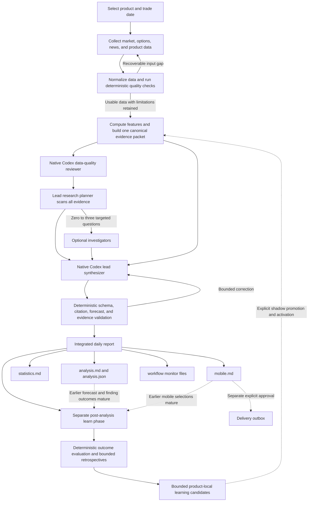

# CurveLens Core

CurveLens Core is a self-improving, multi-commodity futures-and-options research
framework. It combines deterministic data quality and evidence controls with
native-agent research planning, targeted investigations, validated synthesis,
decision-focused daily briefs, and outcome-based product-local learning. One
checkout can operate multiple products while keeping each product's data,
workflow state, learning memory, schedules, and delivery state isolated.

The included product profiles are:

| Product | Available investigator capabilities |
|---|---|
| WTI | Futures curve, volatility surface, physical fundamentals |
| Brent | Futures curve, volatility surface, global physical fundamentals |
| Gold | Futures curve, volatility surface, macro |
| Copper | Futures curve, volatility surface, macro and physical fundamentals |
| Corn | Futures curve, volatility surface, crop fundamentals |
| Silver | Futures curve, volatility surface, macro and industrial fundamentals |
| S&P 500 | Futures basis, volatility, macro, sectors, earnings and corporate events |
| Nasdaq-100 | Futures basis, volatility, growth macro, technology and corporate events |
| Russell 2000 | Futures basis, volatility, credit macro, sectors and corporate events |

The deterministic engine and native-agent workflow are shared. Product facts,
required analyses, knowledge, calendars, and data providers come from the
selected product profile. Repository code does not call a model API, model SDK,
or vendor-model CLI; analytical work is delegated through the operating
Codex/OpenClaw environment.

## Workflow

`agent/analysis_orchestrator.py` is the durable controller. It emits the next
allowed native-agent action, validates each returned response, records monitor
events, and resumes from `run.json` after an interruption.


```mermaid
flowchart TD
    A[Select product and trade date] --> B[Collect market, options, news, and product data]
    B --> C[Normalize data and run deterministic quality checks]
    C -->|Recoverable input gap| B
    C -->|Usable data with limitations retained| D[Compute features and build one canonical evidence packet]

    D --> Q[Native Codex data-quality reviewer]
    Q --> P[Lead research planner scans all evidence]
    P -->|Zero to three targeted questions| I[Optional investigators]
    P --> S[Native Codex lead synthesizer]
    I --> S
    D --> S

    S --> G[Deterministic schema, citation, forecast, and evidence validation]
    G -->|Bounded correction| S
    G --> R[Integrated daily report]

    R --> O1[analysis.md and analysis.json]
    R --> O2[statistics.md]
    R --> O3[mobile.md]
    R --> O4[workflow monitor files]
    R --> L0[Separate post-analysis learn phase]
    O1 -. Earlier forecast and finding outcomes mature .-> L0
    O3 -. Earlier mobile selections mature .-> L0
    L0 --> L1[Deterministic outcome evaluation and bounded retrospectives]
    L1 --> L2[Bounded product-local learning candidates]
    L2 -. Explicit shadow promotion and activation .-> D
    O3 -. Separate explicit approval .-> O5[Delivery outbox]
```

At a high level:

1. Deterministic code collects, normalizes, checks, and calculates. Missing or
   recoverable inputs can be retried; unresolved limitations are retained rather
   than hidden or replaced with fabricated data.
   Risk-neutral distributions are attempted independently for every option
   expiry within a rolling twelve-calendar-month horizon. Valid tenors retain
   their probabilities; failed tenors remain visible with their diagnostics.
2. A native Codex quality reviewer decides whether the prepared evidence is
   usable, usable with limitations, retryable through an allowlisted remedy, or
   blocked.
3. A lead research planner scans the complete canonical packet and dispatches
   zero to three targeted investigations only when a specific question could
   materially change a ranked view, confidence, driver assessment, or watch
   item. Every unused capability is explicitly omitted with a rationale.
4. Optional investigators examine the selected curve, volatility, macro, or
   fundamental question. Their findings carry stable IDs, supporting and
   counterevidence, expected materiality, a one- or five-session horizon, and
   concrete confirmation and invalidation conditions. They are additive research,
   not information gates.
5. The lead synthesizer reads the complete canonical packet directly, the
   validated research plan, and every dispatched investigator response. It can
   use canonical evidence that no investigator selected, records whether each
   finding was used or rejected, and ranks exactly three decision-relevant views.
6. Deterministic validation checks the plan, investigations, citations, copied
   metrics, forecast ledger, mobile selection, and final schema before rendering.
   Agent corrections are bounded. A run that exhausts its correction allowance
   becomes terminally blocked and requires an explicitly authorized restart.
   Analysis completion never authorizes delivery by itself.
7. A complete overnight operation runs the separate `learn` phase after report
   completion. It discovers eligible earlier reports, requests bounded native
   retrospective workers where needed, and rebuilds memory after those actions
   finish. A pending outcome is retained for a later session rather than treated
   as a failed daily report.
8. After the configured future sessions mature, deterministic retrospective
   evaluation scores forecasts, every stable investigator finding, and mobile
   selection separately. Product-local memory candidates require repeated
   samples, explicit shadow promotion, and a replay plus no-degradation gate
   before activation.

The controller persists every phase, so an interrupted run can resume without
repeating completed work. Packet-schema changes require unfinished older runs to
restart. Temporary investigators exist only for the run; the research plan,
tasks, evidence boundaries, responses, finding IDs, and validation results remain
available for inspection.

### Guarded learning

Learning is an auditable hypothesis layer, not autonomous prompt rewriting. The
`start` and `advance` commands complete the daily analysis; they do not silently
invoke learning. A complete overnight operation subsequently runs
`learn --date <as-of-date>`, executes every returned `RUN_RETROSPECTIVE` action,
and repeats the same command until `LEARNING_MEMORY_UPDATED`.

The learning date is an evaluation cutoff, not the source report date. The
controller scans completed reports dated before that cutoff and scores only
outcomes whose configured future sessions have matured. For example, the
natural August 4 learning pass uses `--date 2026-08-04` and can evaluate reports
through August 3; it does not use future data to score the August 4 report.
Versioned retrospective records rebuild
`ccvm/data/products/<product>/learning/memory.json`. Runtime learning data remains
product-isolated and is not checked into the framework repository.

| Advisory family | Stable scope | Allowed effect after activation |
|---|---|---|
| Forecast | Dimension, horizon, and stated confidence | Bounded synthesis calibration |
| Mobile | Source-view rank, expected materiality, and impact dimensions | `mobile_selection` only |
| Investigator | Capability, horizon, expected materiality, and impact dimensions | Research dispatch and assignment only |

Five scored observations create a candidate. Twenty observations make a
non-neutral candidate eligible for explicit promotion into shadow status. Shadow
advice records counterfactual would-use feedback but cannot change analysis.
Activation is another explicit action and requires sufficient shadow reviews,
historical replay, and family-specific no-degradation checks. Current canonical
evidence always takes precedence, and investigator memory is excluded from the
synthesizer's learning context.

### Framework improvement review

Daily learning is product-specific: WTI, Gold, and every other configured product
build their own outcomes and `memory.json`. Framework reflection is a separate,
slower loop that runs once across all product runtimes visible in the shared
checkout. It should not be duplicated in every product agent.

```bash
ccvm/.venv/bin/python agent/framework_review.py start --date YYYY-MM-DD
```

The repository skill `$curvelens-framework-review` drives that controller with
one read-only native reviewer. The deterministic packet has two evidence routes:

| Evidence | Default routing | Shared-review eligibility |
|---|---|---|
| Product narrative observations and suggested adjustments | Product-local only | Never copied into the shared packet |
| Structured forecast, mobile, or investigator scope and outcome metrics | Product-local | Same non-neutral pattern in at least two products |
| Current-schema validation or blocking failures | Workflow trace | Same failure across products, or at least three occurrences in one shared component requiring classification |

The reviewer may classify each routed signal as shared code, shared prompt,
shared validation, product configuration, product knowledge, insufficient
evidence, or already resolved. It writes stable advisory suggestion IDs with
affected paths, expected benefit, risks, tests, and rollback. It cannot modify
the repository or create git state. Implementing a suggestion is always a later,
explicitly approved change with its own tests and reviewed pull request.

## Outputs

Runtime output is isolated by product and trade date:

```text
ccvm/data/products/<product>/
├── analysis/trade_date=<date>/
│   ├── analysis.md
│   ├── analysis.json
│   ├── mobile.md
│   └── statistics.md
├── analysis_workflow/trade_date=<date>/
│   ├── canonical.packet.json
│   ├── research_plan.task.md
│   ├── research_plan.response.json
│   ├── <investigator>.task.md
│   ├── <investigator>.response.json
│   ├── run.json
│   ├── workflow_monitor.md
│   ├── workflow_monitor.json
│   └── workflow_events.jsonl
└── learning/
    ├── memory.json
    └── evaluations/trade_date=<source-date>/
```

Repository-wide review artifacts remain local and separate from every product:

```text
ccvm/data/framework_learning/review_as_of=<date>/
├── framework_review.packet.json
├── framework_review.task.md
├── framework_review.response.json
├── framework_suggestions.json
├── framework_suggestions.md
└── run.json
```

| Output | Purpose |
|---|---|
| `analysis.md` | Primary human-readable report. It combines the top three views, exact supporting statistics, news or driver assessment, conflicts, relevant investigator detail, and forward watch items. |
| `analysis.json` | Validated structured form of the same analysis, including the research plan and investigator finding dispositions, for retrospective evaluation and downstream tools. |
| `mobile.md` | Deterministic phone-first rendering of the same synthesis. It selects one view by default and a second only when independently material for the next session, while preserving any conclusion-changing conflict or limitation. Prose is retained only as complete sentences, and the character budget is met by omitting lower-priority whole lines rather than cutting text mid-sentence. Notification preparation uses this exact file without another summarization pass. |
| `statistics.md` | Numerical audit supplement containing the market snapshot, desk-level measures, comparisons, evidence coverage, and retained limitations. It is not a separate forecast. |
| `workflow_monitor.md` | User-facing debugging view of each agent's assigned task, allowed input files, submitted response, validation status, and correction history. |
| `workflow_monitor.json` | Machine-readable monitor snapshot with artifact paths and hashes. |
| `workflow_events.jsonl` | Append-only timeline of dispatch, validation, correction, phase-change, and finalization events. |
| `run.json` | Durable orchestration state used to resume an interrupted run. |

Monitoring is automatic for new runs. It updates at workflow milestones rather
than streaming private reasoning or token-by-token output. The monitor exposes
controller-visible instructions, evidence, responses, and decisions; it does
not expose hidden chain-of-thought. Rejected responses are archived before a
correction attempt so debugging evidence is preserved.

### Unified market dashboard

One Streamlit server presents every configured product while continuing to read
each product's isolated runtime directory. Start it from the repository root:

```bash
deployments/run_dashboard.sh
```

Open `http://127.0.0.1:8501`, select a configured product in the sidebar, and
then select a trade date. Adding another `ccvm/config/markets/<product>.yaml`
profile automatically adds it to the selector. The dashboard never combines
analysis and investigator packets from different workflow runs; news remains
hidden while a selected run is in progress or its packet identities disagree.
Articles classified by investigators as rejected are not promoted as highlights,
and post-trade-date context is labeled separately.

## Install

### Prerequisites

- Python 3.12 or newer.
- Poppler/`pdftotext` for CME bulletin parsing. On macOS: `brew install poppler`.
- A Codex/OpenClaw environment with repository skills and native sub-agents.
- Headed-browser access for protected CME bulletin downloads.
- Product data credentials as applicable:
  - WTI: `EIA_API_KEY`.
  - Brent: authorized ICE settlement-data access plus `EIA_API_KEY` and
    `FRED_API_KEY` for public context.
  - Gold macro data: `FRED_API_KEY`.
  - Silver macro and industrial proxies: `FRED_API_KEY`.
  - Copper macro and industrial proxies: `FRED_API_KEY`.
  - S&P 500, Nasdaq-100, and Russell 2000: authorized CME futures/options
    handoff files, `FRED_API_KEY`, optional `ALPHAVANTAGE_API_KEY` for upcoming
    earnings, and a descriptive `SEC_USER_AGENT` for EDGAR filings.
  - Corn crop data: `USDA_NASS_API_KEY`.

### Set up the repository

```bash
git clone https://github.com/fangxuyi/curvelens-core.git
cd curvelens-core
python3 -m venv ccvm/.venv
ccvm/.venv/bin/pip install -r ccvm/requirements.txt
cp ccvm/.env.example ccvm/.env
cd ccvm && PYTHONPATH=src .venv/bin/python -m pytest tests/ -q
```

Put product-provider credentials in `ccvm/.env`. Never commit `.env`, delivery
tokens, chat IDs, API keys, runtime data, or outbox state. No separate model API
key is required by this repository because native sub-agents use the operating
Codex/OpenClaw environment.

### Activate a product

Point one operating agent at the repository root and give it one sentence:

- **Operate the CurveLens WTI deployment.**
- **Operate the CurveLens Brent deployment.**
- **Operate the CurveLens Gold deployment.**
- **Operate the CurveLens Copper deployment.**
- **Operate the CurveLens Corn deployment.**
- **Operate the CurveLens Silver deployment.**
- **Operate the CurveLens S&P 500 deployment.**
- **Operate the CurveLens Nasdaq-100 deployment.**
- **Operate the CurveLens Russell 2000 deployment.**

One runtime agent operates exactly one product. It reads the shared framework
instructions and exactly one selected product runbook, verifies the environment,
and keeps every runtime command explicitly scoped with
`CCVM_PRODUCT=<product>`. Separate product agents may share the checkout because
their runtime directories, workflow state, learning memory, schedules, and
delivery settings remain isolated.

To request the first analysis:

```text
Use $curvelens-daily-analysis to run <product> for YYYY-MM-DD.
```

For a complete overnight operation, the checked-in skill first drives the daily
controller through quality review, research planning, any selected
investigations, synthesis, validation, and rendering. It then runs the separate
learning phase for that operation's as-of date, completes eligible retrospective
actions, and rebuilds bounded memory. It does not promote or activate learning
candidates. Those remain separate explicit decisions using the advisory ID.

For bulletin-backed products, the workflow uses the trade date printed inside
the approved bulletin. Notification preparation, schedules, and live delivery
remain separate actions that require explicit approval. Once delivery is
approved, `agent/notify.py --prepare` queues the exact phone-first rendering
saved as `mobile.md`; it does not ask another model to summarize the report.
