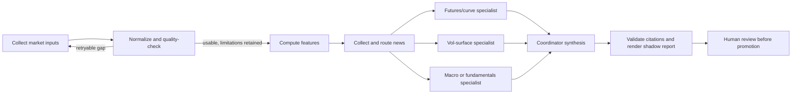

# Agent-Framework Analysis Workflow

## Proposal

CurveLens separates reproducible evidence preparation from analytical judgment.
Collection, normalization, quality diagnostics, calculations, news routing,
evidence IDs, and output validation remain code. Interpretation runs inside the
existing OpenClaw/OpenAI agent framework as independent specialist tasks,
followed by a coordinator synthesis. This path makes no direct model API or
vendor-CLI calls from repository code.



## Why the boundary is deliberate

Code can reliably detect missing files, invalid rows, duplicates, coverage
gaps, and failed model diagnostics. It cannot safely “clean” a structurally
invalid volatility surface by inventing observations. The QC loop retries only
potentially recoverable collection gaps. Remaining problems travel into the
specialist packet as limitations, allowing unaffected sections to proceed.

Model work belongs to the agent framework because source judgment, narrative
comparison, causal uncertainty, and forward scenarios are analytical tasks.
Separate specialists reduce cross-domain anchoring. A final coordinator sees
their completed outputs and explicitly reconciles agreements and tensions.

## Daily contract

Prepare packets with an explicit product:

```bash
CCVM_PRODUCT=gold ccvm/.venv/bin/python agent/run_analysis_workflow.py --date YYYY-MM-DD
```

The command emits a manifest under the product-isolated data directory. It
contains role names, packet paths, response-template paths, an evidence
registry, and the synthesis contract. Each role packet contains only configured
computed sections, routed articles, QC results, required checks, and citation
rules.

The coordinator delegates every listed role through native framework
sub-agents. Each specialist fills its own JSON template with:

- a data-quality assessment;
- what the computed data says;
- what the relevant news says;
- where news supports, conflicts with, or fails to explain the data;
- a forward view with horizon, confirmations, and invalidations;
- evidence IDs and open questions.

After every role returns, the coordinator fills the synthesis template and
runs:

```bash
CCVM_PRODUCT=gold ccvm/.venv/bin/python agent/finalize_analysis.py --date YYYY-MM-DD
```

The finalizer rejects missing roles, stale packet IDs, placeholder statuses,
and unknown citations. It writes JSON and Markdown under
`data/products/<product>/analysis/trade_date=<date>/`.

## Rollout

This branch is shadow-only. It does not modify `notify.py`, outboxes, schedules,
or current production delivery. Compare shadow reports with the deterministic
brief over multiple dates, review failure modes and runtime cost, then promote
the synthesized report only through a separate reviewed change.
