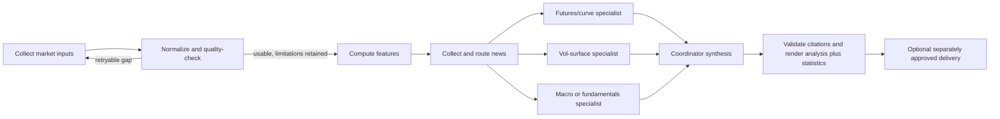

# Agent-Framework Analysis Workflow

## Proposal

CurveLens separates reproducible evidence preparation from analytical judgment.
Collection, normalization, quality diagnostics, calculations, news routing,
evidence IDs, and output validation remain code. Interpretation runs inside the
existing OpenClaw/OpenAI agent framework as independent specialist tasks,
followed by a coordinator synthesis. This path makes no direct model API or
vendor-CLI calls from repository code.



## Why the boundary is deliberate

Code can reliably detect missing files, invalid rows, duplicates, coverage
gaps, and failed model diagnostics. It cannot safely “clean” a structurally
invalid volatility surface by inventing observations. The QC loop retries only
potentially recoverable collection gaps. Remaining problems travel into the
specialist packet as limitations, allowing unaffected sections to proceed.

Model work belongs to the agent framework because source judgment, narrative
comparison, causal uncertainty, and forward scenarios are analytical tasks.
Separate specialists reduce cross-domain anchoring. A final coordinator sees
their completed outputs and explicitly reconciles agreements and tensions.

## Orchestrator choice

Use native Codex subagents rather than LangGraph, CrewAI, or an application-side
Agents SDK. Native delegation already supplies fan-out, waiting, and isolated
agent contexts without adding model credentials or repository-owned LLM calls.
The repository contributes the durable control plane:

- `.agents/skills/curvelens-daily-analysis/SKILL.md` coordinates the host run;
- `.codex/agents/` defines generic QC, specialist, and synthesis workers;
- `agent/analysis_orchestrator.py` persists state and emits allowed next actions;
- product profiles define roles and quality policy without product-name branches.

## Daily contract

Start or resume the complete orchestration with an explicit product:

```bash
CCVM_PRODUCT=gold ccvm/.venv/bin/python agent/analysis_orchestrator.py start --date YYYY-MM-DD
```

The command prepares evidence and emits a durable `run.json` plus the next
native-agent action. State is isolated by product and date. The controller
enforces `QC_REVIEW_REQUIRED → SPECIALISTS_REQUIRED → SYNTHESIS_REQUIRED →
READY_TO_FINALIZE → COMPLETE`, with bounded remediation/correction cycles and a
terminal `BLOCKED` state.

The coordinator delegates every listed role through native framework
sub-agents. Each specialist fills its own JSON template with:

- a data-quality assessment;
- what the computed data says;
- what the relevant news says;
- where news supports, conflicts with, or fails to explain the data;
- a forward view with horizon, confirmations, and invalidations;
- evidence IDs and open questions.

After each returned action completes, advance the controller:

```bash
CCVM_PRODUCT=gold ccvm/.venv/bin/python agent/analysis_orchestrator.py advance --date YYYY-MM-DD
```

The repository-scoped `$curvelens-daily-analysis` skill runs this loop using
native Codex subagents. Generic custom agent types cover QC, an arbitrary
packet-defined specialist, and synthesis; product profiles determine the roles.
The controller rejects missing roles, stale packet IDs, unanswered required
checks, placeholder statuses, and unknown citations. It writes `analysis.json`,
the interpretive `analysis.md`, and the descriptive `statistics.md` under
`data/products/<product>/analysis/trade_date=<date>/`. The statistics renderer
reuses validated key metrics and does not invoke another model.

## Supported operating path

This is the sole supported end-to-end daily-analysis workflow. The former
script-only `agent/run_pipeline.py` entry point was removed so scheduled and
interactive runs cannot silently bypass QC review, specialist analysis, or
synthesis. The deterministic scripts remain internal evidence-preparation
stages owned by the controller.

Analysis and delivery remain separate authorities. The controller never touches
`notify.py`, an outbox, or a delivery destination. A product runbook may permit
delivery only after its acceptance gates and an explicit human approval.
