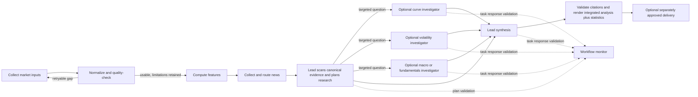

# Agent-Framework Analysis Workflow

## Proposal

CurveLens separates reproducible evidence preparation from analytical judgment.
Collection, normalization, quality diagnostics, calculations, news routing,
evidence IDs, and output validation remain code. Interpretation runs inside the
existing OpenClaw/OpenAI agent framework as a complete lead scan, optional
targeted investigations, and lead synthesis. This path makes no direct model API or
vendor-CLI calls from repository code.


```mermaid
flowchart LR
  A[Collect market inputs] --> B[Normalize and quality-check]
  B -->|retryable gap| A
  B -->|usable, limitations retained| C[Compute features]
  C --> D[Collect and route news]
  D --> P[Lead scans canonical evidence and plans research]
  P -->|targeted question| E1[Optional curve investigator]
  P -->|targeted question| E2[Optional volatility investigator]
  P -->|targeted question| E3[Optional macro or fundamentals investigator]
  P --> F[Lead synthesis]
  E1 --> F
  E2 --> F
  E3 --> F
  F --> G[Validate citations and render integrated analysis plus statistics]
  P -. plan validation .-> M[Workflow monitor]
  E1 -. task response validation .-> M
  E2 -. task response validation .-> M
  E3 -. task response validation .-> M
  F -. task response validation .-> M
  G --> H[Optional separately approved delivery]
```

## Why the boundary is deliberate

Code can reliably detect missing files, invalid rows, duplicates, coverage
gaps, and failed model diagnostics. It cannot safely “clean” a structurally
invalid volatility surface by inventing observations. The QC loop retries only
potentially recoverable collection gaps. Remaining problems travel into the
canonical packet and investigator outputs as limitations, allowing unaffected sections to proceed.

Model work belongs to the agent framework because source judgment, narrative
comparison, causal uncertainty, and forward scenarios are analytical tasks.
Targeted investigators reduce cross-domain anchoring without becoming information
gates. The lead retains complete evidence access and explicitly accepts or rejects
each stable investigator finding.

## Orchestrator choice

Use native Codex subagents rather than LangGraph, CrewAI, or an application-side
Agents SDK. Native delegation already supplies fan-out, waiting, and isolated
agent contexts without adding model credentials or repository-owned LLM calls.
The repository contributes the durable control plane:

- `.agents/skills/curvelens-daily-analysis/SKILL.md` coordinates the host run;
- `.codex/agents/` defines generic QC, planning, investigator, and synthesis workers;
- `agent/analysis_orchestrator.py` persists state and emits allowed next actions;
- `ccvm.workflow.monitoring` records controller-visible inputs, outputs,
  corrections, and phase events without making model calls;
- product profiles define roles and quality policy without product-name branches.

## Daily contract

Start or resume the complete orchestration with an explicit product:

```bash
CCVM_PRODUCT=gold ccvm/.venv/bin/python agent/analysis_orchestrator.py start --date YYYY-MM-DD
```

The command prepares evidence and emits a durable `run.json` plus the next
native-agent action. State is isolated by product and date. The controller
enforces `QC_REVIEW_REQUIRED → RESEARCH_PLAN_REQUIRED → optional
INVESTIGATORS_REQUIRED → SYNTHESIS_REQUIRED → READY_TO_FINALIZE → COMPLETE`,
with bounded remediation/correction cycles and a
terminal `BLOCKED` state.

The lead scans complete canonical evidence and selects zero to three targeted
investigations. Each dispatched investigator fills its own JSON template with:

- a data-quality assessment;
- what the computed data says;
- what the relevant news says;
- where news supports, conflicts with, or fails to explain the data;
- stable candidate-finding IDs, materiality, horizon, counterevidence,
  confirmations, and invalidations;
- evidence IDs and open questions.

After each returned action completes, advance the controller:

```bash
CCVM_PRODUCT=gold ccvm/.venv/bin/python agent/analysis_orchestrator.py advance --date YYYY-MM-DD
```

The repository-scoped `$curvelens-daily-analysis` skill runs this loop using
native Codex subagents. Generic custom agent types cover QC, lead planning, an arbitrary
packet-defined investigator, and synthesis; product profiles determine available capabilities.
The controller rejects missing dispatched investigators, stale packet IDs, unanswered required
checks, placeholder statuses, and unknown citations. It writes `analysis.json`,
the integrated interpretive-and-numerical `analysis.md`, and the audit-oriented
`statistics.md` under
`data/products/<product>/analysis/trade_date=<date>/`. The statistics renderer
reuses validated key metrics and does not invoke another model.

Each of the three ranked synthesis views must connect 2-3 validated numbers to
supporting and conflicting evidence, label the driver assessment as supported,
partially supported, conflicting, or unexplained, and state what would confirm
or invalidate the view next. This structure keeps news and fundamentals in the
analysis without overstating causal attribution.

The full synthesis separately records a validated `mobile_selection` decision
for all three views. Mobile selects one view by default and at most two; it does
not need to represent every investigator. Routine, redundant, background, and
low-impact detail stays in the full report. The deterministic renderer preserves
exact numbers and includes a conflict or data limitation only when the selection
marks it as material to the conclusion.

## Workflow inspection

The controller updates three product- and date-isolated debugging artifacts:

- `workflow_events.jsonl` is the append-only phase, dispatch, validation, and
  correction timeline;
- `workflow_monitor.json` is a machine-readable snapshot of every worker's
  allowed inputs, output, status, hashes, and latest validation result;
- `workflow_monitor.md` is the user-facing view with exact assigned task text,
  links to evidence packets and schemas, submitted response JSON, and the event
  timeline.

Use the read-only command below at any point in a run:

```bash
CCVM_PRODUCT=gold ccvm/.venv/bin/python agent/analysis_orchestrator.py inspect --date YYYY-MM-DD
```

Rejected response files are archived before their active response slot is
cleared for correction. The monitor intentionally does not expose hidden
chain-of-thought or host-runtime tool telemetry; it records the auditable
instructions, evidence boundaries, structured rationale, outputs, and
controller decisions.

## Supported operating path

This is the sole supported end-to-end daily-analysis workflow. The former
script-only `agent/run_pipeline.py` entry point was removed so scheduled and
interactive runs cannot silently bypass QC review, lead planning, dispatched investigations, or
synthesis. The deterministic scripts remain internal evidence-preparation
stages owned by the controller.

Analysis and delivery remain separate authorities. The controller never touches
`notify.py`, an outbox, or a delivery destination. A product runbook may permit
delivery only after its acceptance gates and an explicit human approval.

## Retrospective learning loop

Stable investigator findings declare a one- or five-session horizon and the
price, volatility, or market-impact dimensions expected to matter. The
retrospective materializes those outcomes independently of final-view forecasts,
scores realized materiality, and preserves the lead's use or rejection decision.
This supports omission and usefulness evaluation without treating later movement
as proof that the investigator's causal explanation was correct.

Daily synthesis records an evidence-linked forecast ledger for price direction,
volatility direction, and move magnitude. After future sessions mature, run:

```bash
CCVM_PRODUCT=gold ccvm/.venv/bin/python agent/analysis_orchestrator.py learn --date YYYY-MM-DD
```

The controller materializes versioned outcomes, scores direction and confidence,
scores every selected and omitted mobile candidate against configured one-session
absolute price or implied-volatility movement, summarizes controller-visible
retries, and emits bounded retrospective actions. Mobile scoring is separate
from forecast correctness and reports precision, false prominence, missed
material rate, and overall selection accuracy.
It never evaluates hidden chain-of-thought. Re-run `learn` after completing those
actions to rebuild product-isolated memory.

Candidates require five scored samples and cannot influence analysis. With at
least twenty samples, an explicitly selected candidate may enter shadow status:

```bash
CCVM_PRODUCT=gold ccvm/.venv/bin/python agent/analysis_orchestrator.py promote-learning \
  --advisory-id learning:<id>
```

Shadow advisories are included only for would-use feedback. Activation remains
a separate explicit action and requires at least five shadow reviews plus a
historical replay and no-degradation check:

```bash
CCVM_PRODUCT=gold ccvm/.venv/bin/python agent/analysis_orchestrator.py activate-learning \
  --advisory-id learning:<id>
```

At most eight shadow and eight active advisories are retained. The exact memory
snapshot is hashed into the next analysis packet. Learning never authorizes
delivery, changes deterministic outcome thresholds, or substitutes for current
market evidence.

Mobile relevance builds a separate product-isolated advisory set in the same
`learning/memory.json`. Its stable scope is source-view rank, ex-ante
materiality, and linked impact dimensions. It recommends `prefer_select` only
after that scope repeatedly precedes material next-session movement, or
`prefer_omit` when it repeatedly remains muted. Mobile candidates use the same
five-sample candidate and twenty-sample promotion gates and the same explicit
promotion and activation commands, with IDs beginning `mobile-learning:`.

At most four mobile advisories may be shadow and four active. Active mobile
advice may affect only `mobile_selection`; it cannot change the full views,
forecast ledger, confidence, evidence, or wording. Shadow activation requires
at least five would-use reviews, historical replay, no more than a five-point
selection-accuracy degradation, no increase in missed-material rate, and no
more than a five-point false-prominence increase. Active advice is retired if
those safeguards later fail.

Investigator relevance builds a third product-isolated advisory set in the same
file. It groups deterministic finding outcomes by configured capability, finding
horizon, expected materiality, and impact dimensions. IDs begin
`investigator-learning:` and use the same five-sample candidate, twenty-sample
promotion, explicit shadow, and explicit activation lifecycle. Four shadow and
four active entries are allowed.

Active investigator advice is visible only to the research planner. A matching
`prefer_dispatch` or `prefer_skip` advisory can shape dispatch and assignment only
when the planner records that it used the advisory; rejection leaves the current
evidence-based plan unchanged. Shadow advice records counterfactual would-use
feedback and cannot affect dispatch. Activation requires five shadow reviews,
historical replay, and no more than five percentage points of materiality
degradation. Advice for removed capabilities, unsupported horizons, or unsupported
impact dimensions is excluded when packets are built. The synthesizer never receives
investigator advisories, so historical planning memory cannot become an uncited
market view or alter report wording directly.
